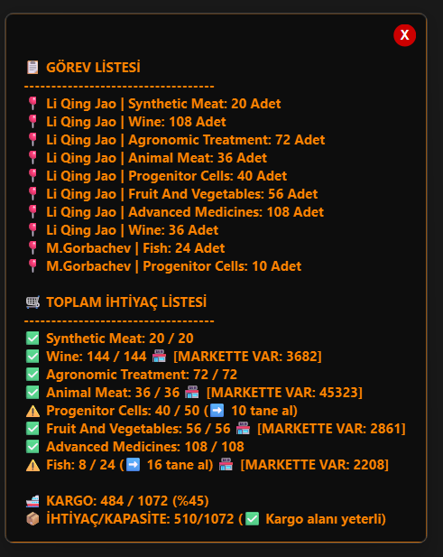
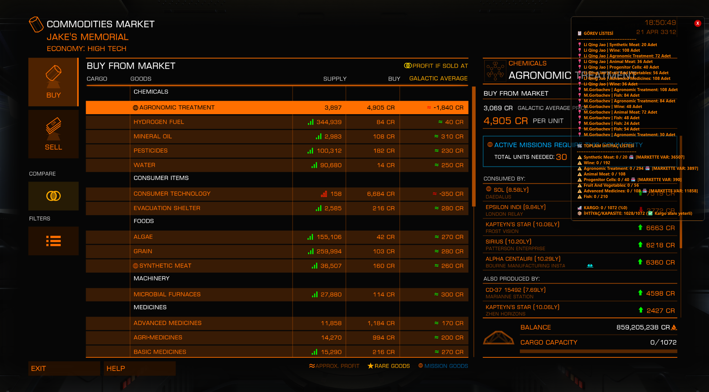
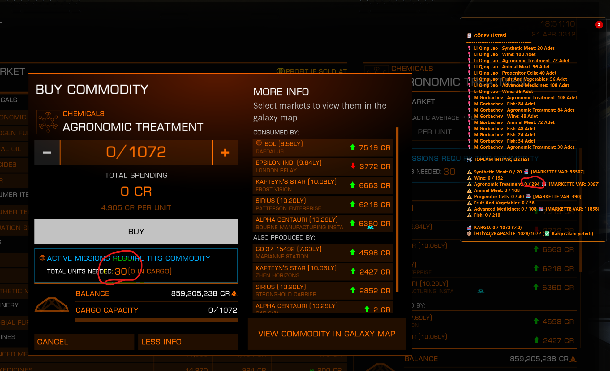
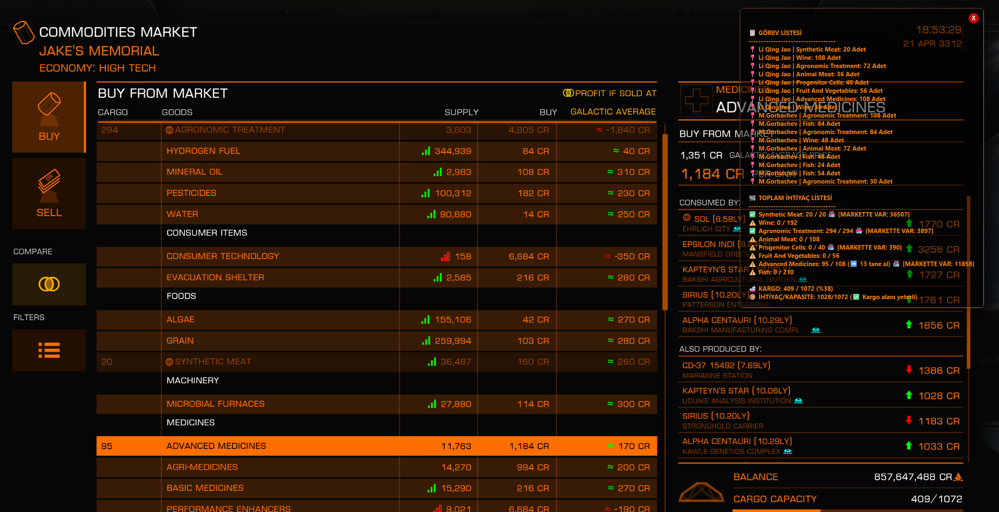

# 🚀 Elite Dangerous Mission & Cargo Tracker HUD

Elite Dangerous oyuncuları için geliştirilmiş, şeffaf, oyun penceresinin üstünde durabilen (Always on Top) ve anlık olarak görev ve kargo takibi yapan hafif bir HUD aracıdır. Oyun loglarını (`Journal` ve `Cargo.json`) anlık okuyarak çalışır.

## 🌟 Özellikler
* **Anlık Görev Takibi:** Alınan teslimat ve bağış görevlerini otomatik listeler.
* **Akıllı İhtiyaç Listesi:** Tüm görevler için gereken toplam mal miktarını hesaplar.
* **Canlı Market Kontrolü:** Bulunduğunuz istasyonun marketinde ihtiyaç duyduğunuz mallardan stok varsa anında uyarır `🏪 [MARKETTE VAR: X]`.
* **Kargo Durumu:** Geminizin anlık kargo doluluğunu ve kapasitesini gösterir.
* **Oyun İçi Kullanım:** Şeffaf arkaplanı sayesinde oyun ekranını kapatmaz, ekranda sol tık ile istenilen yere sürüklenebilir.

## 📸 Ekran Görüntüleri

## 📥 Nasıl Kurulur ve Kullanılır?

### Seçenek 1: Direkt Çalıştırma (Tavsiye Edilen)
Sağ taraftaki **Releases** bölümünden `mission.exe` dosyasını indirin ve çift tıklayıp çalıştırın. Hiçbir kurulum gerektirmez.

### Seçenek 2: Kaynak Kodundan Çalıştırma
Eğer bilgisayarınızda Python yüklüyse:
1. Bu repoyu indirin.
2. `baslat.bat` dosyasına çift tıklayın. (Eksik kütüphaneleri otomatik kurup başlatacaktır).

---

## ⚠️ Virüs Tarama (False Positive) Hakkında Önemli Not
`mission.exe` dosyası, Python kodunun herkes tarafından kolayca kullanılabilmesi için **PyInstaller** kullanılarak derlenmiştir. PyInstaller, tüm Python altyapısını tek bir dosyaya sıkıştırdığı için Windows Defender ve VirusTotal üzerinde bazı sezgisel (heuristic) motorlar (örn: *Wacatac.B!ml*) tarafından **yanlış alarm (False Positive)** üretebilir.

Bu tamamen PyInstaller'ın çalışma mantığından kaynaklı, açık kaynak dünyasında çok bilinen zararsız bir durumdur. Güvenmeyen veya şüphe duyan kullanıcılar doğrudan `.py` uzantılı açık kaynak kodunu inceleyebilir ve `baslat.bat` ile kendi bilgisayarlarında kendileri çalıştırabilirler.

## 🛠️ Geliştirici İçin
Kodu kendiniz derlemek isterseniz, klasör içindeki `exe_yap.bat` dosyasını çalıştırarak kendi temiz `.exe` dosyanızı oluşturabilirsiniz.
